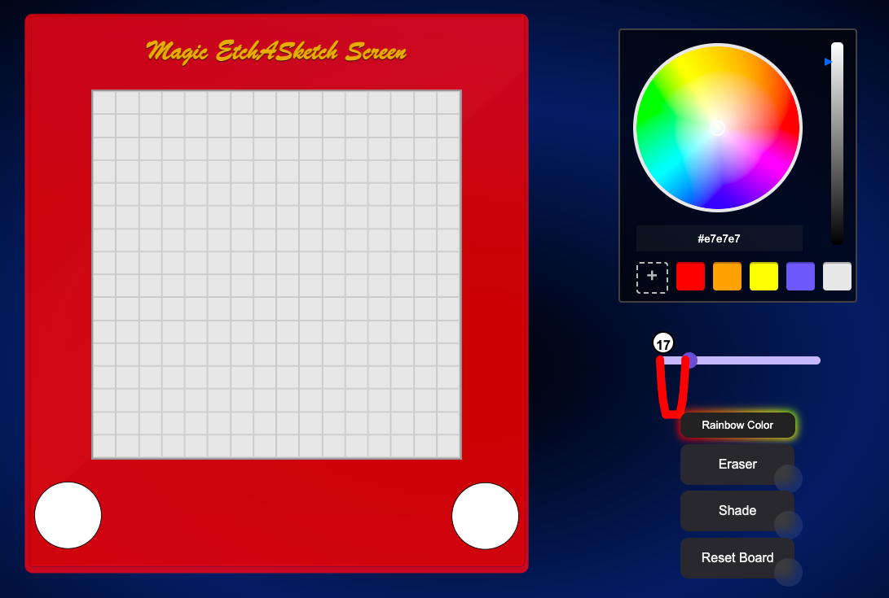

# Magic Etch-A-Sketch

Welcome to Magic Etch-A-Sketch, a web-based drawing application where you can unleash your creativity! This project is developed as part of [The Odin Project](https://www.theodinproject.com/) curriculum.



## Table of Contents

- [Demo](#demo)
- [Features](#features)
- [Usage](#usage)
- [Contributing](#contributing)
- [Credits](#credits)
- [License](#license)

## Demo

You can try out Magic Etch-A-Sketch by visiting the live demo [here](https://thedividedorange.github.io/Project-Etch-a-sketch/).

## Features

- Draw and sketch with a variety of colors.
- Use the rainbow color button to paint with a dynamic rainbow palette.
- Erase mistakes with the eraser tool.
- Apply shading effects to your drawings.
- Adjustable grid size for finer or broader details.
- Responsive design for a seamless experience on different devices.

## Usage

1. Clone the repository:

   ```bash
   gh repo clone thedividedorange/Project-Etch-a-sketch
   ```
## Contributing

Contributions are welcome! If you find any bugs, have feature requests, or want to contribute improvements, feel free to open an issue or submit a pull request.

Please make sure to follow the code of conduct.

## Credits
[Codehim.com](https://codehim.com) for the color wheel picker.
[Anurag Hazra](https://github.com/anuraghazra) for the amazing slider used in this project